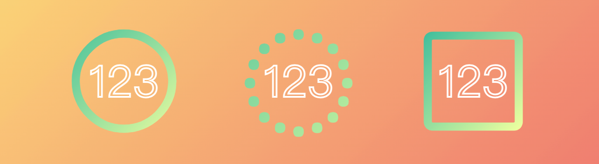

CSS 圆形渐变边框，背景透明

## 读完我可以收获

- CSS 圆形、圆角渐变边框的实现方式
- background-clip、text-stroke 的使用

## 背景

.gif)

在网上找到的很多方式是通过 background 加渐变，然后再加个纯色背景对渐变进行覆盖，通过 background-clip 实现这种效果。这篇文章写的很好：【这篇文章】https://juejin.cn/post/6844903972281516045

但是想要背景透明就没办法了。今天在思考如何让背景部分透明的时候，突然想到了 background-clip 文字裁剪，发现这个就能实现我想要的效果。

关于 background-clip 属性，是用来设置背景的裁剪范围的，主要分为 border-box, content-box, padding-box, text, 我们此处使用的就是 text。详细可以参考：

https://developer.mozilla.org/zh-CN/docs/Web/CSS/background-clip

【文字遮罩图片】

如果我希望实现一个圆形边框的话，只需要找一个完美的圆就好了，然后让文字之外的部分透明，我找啊找找到了好多 ◯ hhhhhh，下面请看实践。

## 实践

首先实现文字背景遮罩

```less
.box {
  margin: 0 50px;
  width: 100px;
  height: 100px;
  display: flex;
  align-items: center;
  justify-content: center;
  border-radius: 50%;
  overflow: visible;
  font-size: 50px;
  position: relative;
  color: transparent;
  -webkit-text-stroke: white 2px;

  &::after {
    width: 100%;
    height: 100%;
    font-size: 100px;
    font-family: Arial;
    position: absolute;
    top: 0;
    left: 0;
    background-image: linear-gradient(135deg, #43c6ac, #f8ffae);
    background-clip: text;
    -webkit-background-clip: text;
    -moz-background-clip: text;
    color: transparent;
    display: flex;
    align-items: center;
    justify-content: center;
    -webkit-text-stroke-color: transparent;
  }
}
```




然后利用 after 伪元素叠加到我们的盒子的边框上。

这时我们会发现边框有些粗，可以通过 font-weight 进行调节，但是粗细范围很有限，这里我发现了另一个奇妙的属性：text-stroke，我们可以通过它调节文字描边宽度，font-weight 设为400 即可。

对于大小的调节，如果 font-size 不能满足要求，我们可以借助 transform：scale 实现尺寸调整。

## 总结 & 源码

源码在这里，有需要的可以参考一下：

https://code.juejin.cn/pen/7247051025881202745

## 注意事项

对于边框是直线，伸缩样式都一样的，效果最佳。

要设置好字体，最好设置通用的字体，如 Arial，所有浏览器都会支持，建议加 important 避免系统字体干扰，设置 color 为透明

字符集来源，建议测试下低版本浏览器的兼容性：

https://en.wiktionary.org/wiki/Appendix:Unicode/Geometric_Shapes

https://caniuse.com/?search=text-stroke
