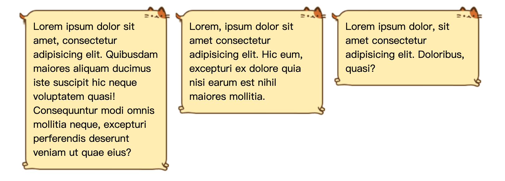
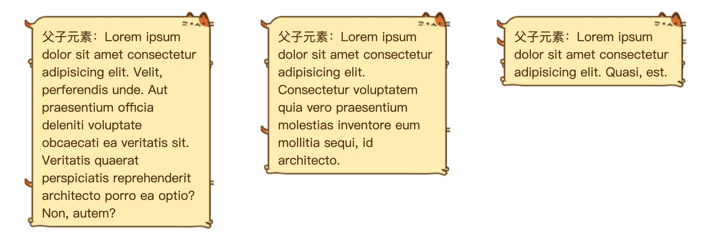
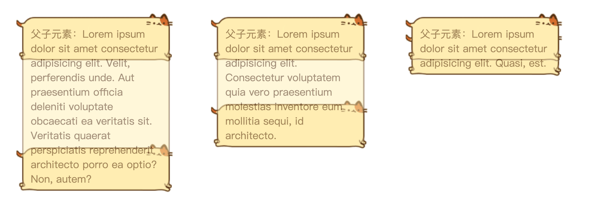
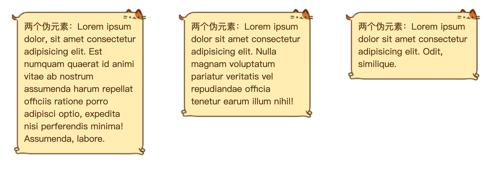
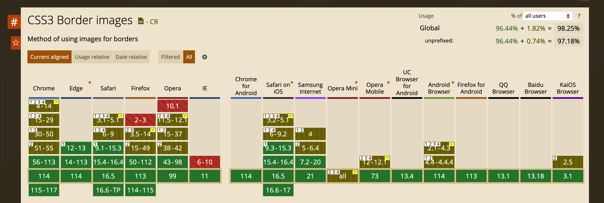

H5 背景图片自适应文案拉伸

## 读完我可以收获

- border-image 的简单介绍及使用
- 背景图片自适应文案拉伸的两种方法

## 背景

.gif)

业务开发中，有这种聊天气泡的场景，最开始文案很短，直接用 UI 给的气泡切图当作 background，需求迭代的时候，文案变成多行了，background 切图会被拉伸（图左），很丑。此时比较无脑的方法就是找 UI 切一张新的图，但这样每次文案变化，都要重新出图，很麻烦。经过一番查找和大佬的指点，发现两种实现方式（图右），一起来看一下。

## 方法一：border-image （实现简单）

使用 border-image 可以把图片填充到 border 上，效果很好，而且 border-image 不仅可以实现这种自动拉伸，还可以设置自动平铺，以实现花边效果。对 border-image 各属性和具体使用不熟悉的话，可以先阅读上一篇，此处直接上代码。

```html
<html>
  <style>
    body {
      display: flex;
      align-items: flex-start;
      justify-content: center;
    }
    .box {
      width: 251px;
      min-height: 85px;
      border: 25px solid transparent;
      border-image: url(https://xxxx.png) 25 fill;
      box-sizing: border-box;
      word-break: break-word;
    }
  </style>
  <body>
    <div class="box">
      Lorem ipsum dolor sit amet, consectetur adipisicing elit. Quibusdam
      maiores aliquam ducimus iste suscipit hic neque voluptatem quasi!
      Consequuntur modi omnis mollitia neque, excepturi perferendis deserunt
      veniam ut quae eius?
    </div>
    <div class="box">
      Lorem, ipsum dolor sit amet consectetur adipisicing elit. Hic eum,
      excepturi ex dolore quia nisi earum est nihil maiores mollitia.
    </div>
    <div class="box">
      Lorem ipsum dolor, sit amet consectetur adipisicing elit. Doloribus,
      quasi?
    </div>
  </body>
</html>
```



## 方法二：元素叠加（兼容性好）

原理是将图像分成头身尾三部分，头尾不动，身子自适应拉伸。

这里有两种方式实现：

第一个是两个 div 叠加，上面的 div 展示头尾，下面的 div 只展示中间，但是边框不规则的话容易穿帮，不太推荐。

另一个方法就是使用伪元素，before 做头，after 做尾，不需要添加额外的 DOM 节点，更加优雅。（这里也可以使用三个 dom 实现，不举例了）

具体代码及效果如下：

```less
:root {
  --img-url: url('https://xxxxx.png');
}

.chatBox3 {
  padding: 25px 0 15px;
  background: var(--img-url) no-repeat top center / auto,
    var(--img-url) no-repeat bottom center / auto;
  .inner {
    min-height: 40px;
    padding: 0 25px;
    background: var(--img-url) no-repeat;
    background-position: center;
    background-size: 100% 300%;
  }
}

.chatBox4 {
  padding: 0 25px;
  background: var(--img-url) no-repeat;
  background-position: center;
  background-size: 100% 300%;
  background-clip: padding-box;
  overflow: visible;
  min-height: 40px;
  position: relative;

  &::before,
  &::after {
    content: '';
    display: block;
    position: absolute;
    width: 100%;
    height: 25px;
    left: 0;
    background: var(--img-url) no-repeat;
  }

  &::before {
    top: -25px;
    background-position: top center;
  }
  &::after {
    bottom: -25px;
    background-position: bottom center;
  }
}
```



这里有一点点穿帮，父元素展示的头尾，小猫的脚没有挡住，设置一下透明度，我们就可以看到具体的实现的结构了：



下面是使用伪元素的示例，看着效果非常好：



## 总结 & 源码

同样的原理，我们也可以实现横向的自适应拉伸。

.gif)

源码放上来，有需要的朋友可以在这里体验：

https://code.juejin.cn/pen/7246656759119478844

## 注意事项

border-image 已经被广泛兼容了，比较优雅。

但是如果需要兼容特别老的浏览器（比如 IE），可以降级使用元素叠加的方式。附一张兼容性截图。


